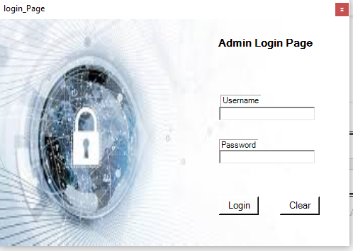
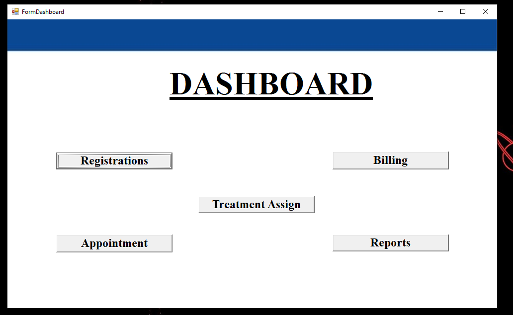
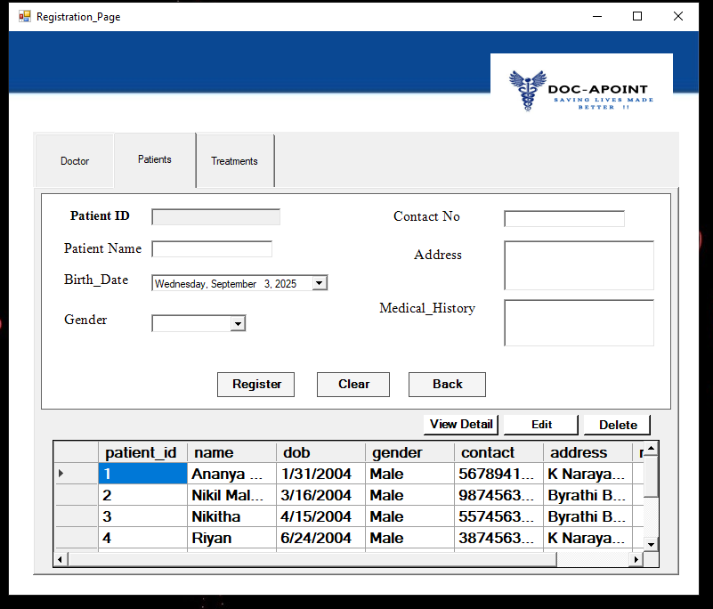
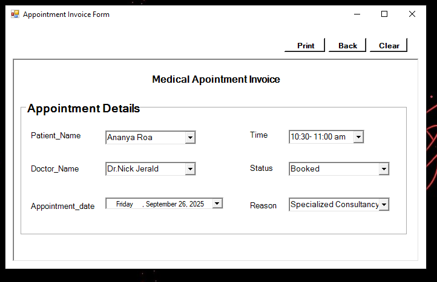
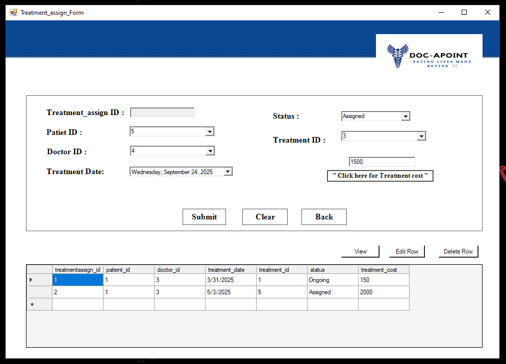
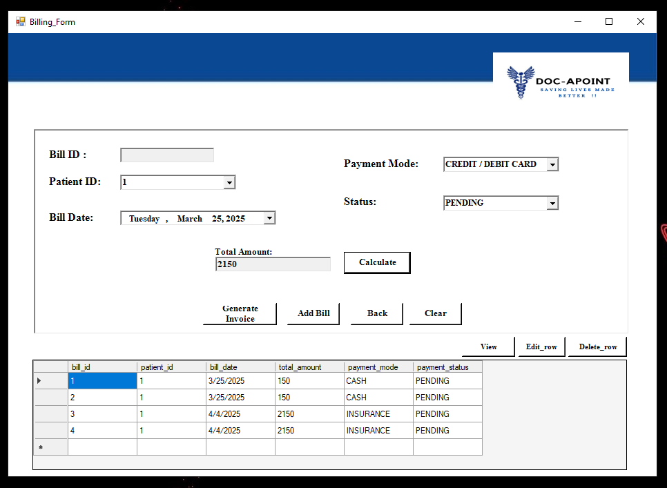
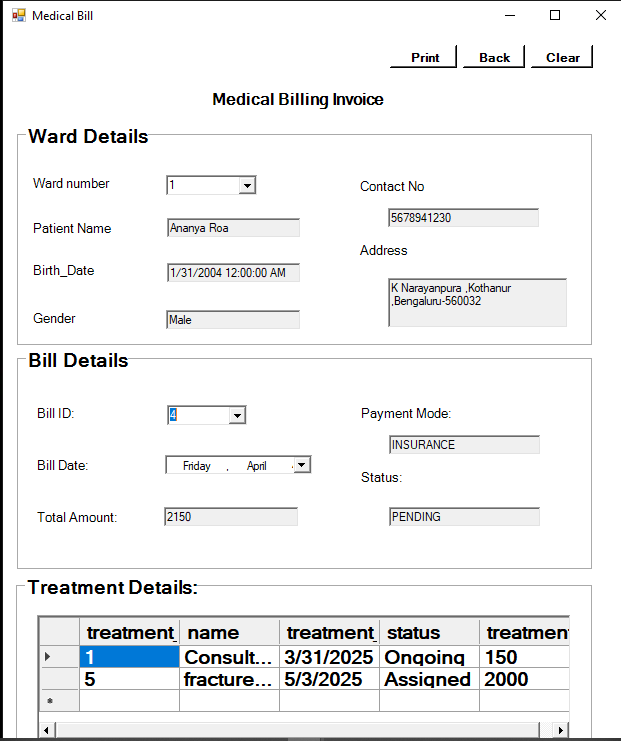
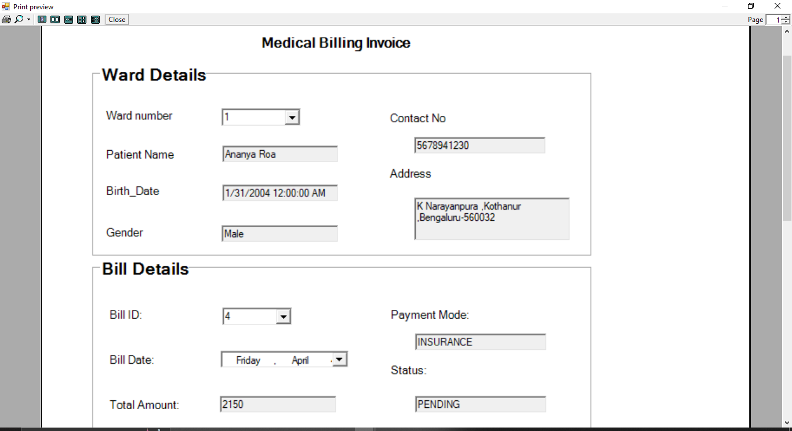
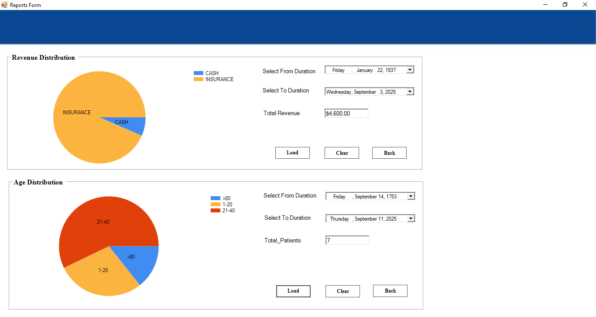

🏥 Doctor Appointment Management System (DOC-APOINT)

   

📖 Overview

DOC-APOINT is a comprehensive offline healthcare management system tailored for small to mid-scale clinics.
It simplifies doctor scheduling, patient management, billing, and reporting — all without requiring internet connectivity.

⚡ Designed to make clinic operations smooth, secure, and efficient.

⚙️ Features

|            |  |    |
| :-------------------------------------------------------------------------: | :---------------------------------------------------------------------------: | :---------------------------------------------------------------------: |
|        Access anytime without internet, ensuring safe & secure data.        |         Manage and assign doctors with real-time appointment updates.         |    Monitor income seamlessly across Cash, Card, and Online payments.    |
|  |          |  |
|      Gain actionable insights with patient demographics & age analysis.     |        Keep treatments, patients, and billing in one organized system.        |       Generate, store, and print professional invoices in seconds.      |

🖼️ Screenshots

Login Screen
  

Dashboard Screen
  

Registration Screen
  

Appointment Screen
  

Appointment Invoice
  

Treatment Assignment
  

Billing Screen
  

Billing Invoice
  

Invoice Appearance
  

Report Analysis
  

🚀 Usage

👨‍⚕️ Admins:

Manage Doctors, Patients, Appointments, Treatments, and Billing.

Generate revenue reports and demographic insights.

🧑‍🤝‍🧑 Patients:

Book appointments on-site with real-time scheduling.

Receive printed invoices after consultations.

📊 Reports:

Analyze clinic performance & patient demographics to support decision-making.

📜 License

This project is licensed under the MIT License.

📬 Contact

📧 Email: prajwalmhere@gmail.com

👤 Maintainer: Prajwal Murthy

⚡ DOC-APOINT makes healthcare administration simpler, faster, and smarter — empowering clinics with offline-ready management.
